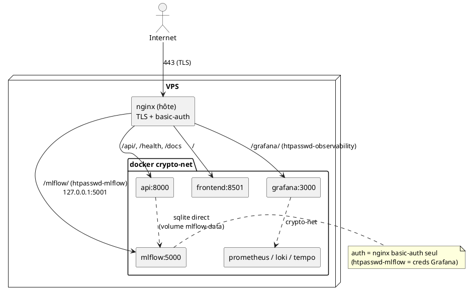
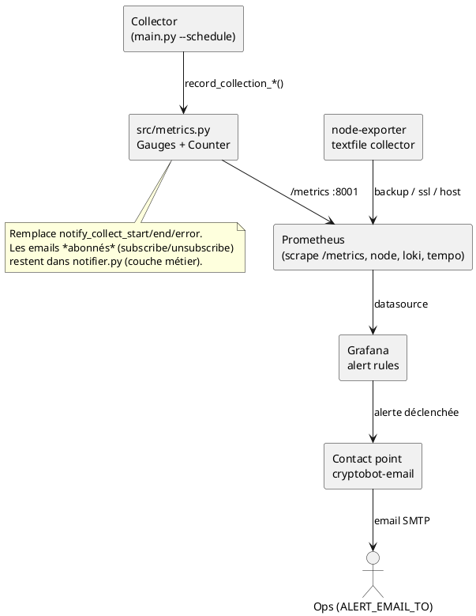

# Infra — CryptoBot

Infrastructure de production : Docker Compose (services applicatifs + observabilité),
provisionnée et déployée via Ansible (`infra/ansible/`), exposée par un nginx hôte
en reverse proxy TLS sur `https://dtsc-cryptobot.fr`.

## Topologie réseau



Prometheus / Loki / Tempo / MLflow ne sont **jamais** publiés sur l'internet :
ils ne sont joignables que via le réseau Docker `crypto-net` ou en `127.0.0.1`,
derrière nginx.

## Sécurité des endpoints d'observabilité

Grafana et MLflow ne suivent **pas** le même modèle d'auth :

- **Grafana** : deux couches — `auth_basic` nginx (`.htpasswd-observability`) **et**
  login natif (`GF_SECURITY_ADMIN_*`).
- **MLflow** : **une seule** couche — `auth_basic` nginx (`.htpasswd-mlflow`).
  L'auth native MLflow a été **retirée** : son `basic_auth.ini` (lu par configparser)
  plantait sur les caractères spéciaux du mot de passe Grafana → 502.

Les deux fichiers htpasswd sont générés par Ansible à partir de variables (jamais
en clair dans le repo) et utilisent les **mêmes identifiants que Grafana**.

Les deux sont servis sous un **sous-chemin** (`/grafana`, `/mlflow`) pour rester
cohérents et permettre la cohabitation sur le même vhost.

| Endpoint | nginx | htpasswd | App auth | Sous-chemin |
|----------|-------|----------|----------|-------------|
| Grafana  | `/grafana/` | `.htpasswd-observability` | `GF_SECURITY_ADMIN_*` | `GF_SERVER_SERVE_FROM_SUB_PATH` |
| MLflow   | `/mlflow/`  | `.htpasswd-mlflow`        | **aucune** (native retirée) | `--static-prefix /mlflow` |

### MLflow — avant / après

| | Avant | Après |
|-|-------|-------|
| Publication port | `5001:5000` (exposé sur **toutes** les interfaces) | `127.0.0.1:5001:5000` (localhost only) |
| Route nginx | aucune | `/mlflow/` avec `auth_basic` + `.htpasswd-mlflow` |
| Auth applicative | aucune | **aucune** — auth native retirée (cassait sur mots de passe à caractères spéciaux → 502) |
| Sous-chemin | non | `--static-prefix /mlflow` |
| Accès externe | **public, sans auth** | TLS + basic-auth obligatoire |
| Accès interne | docker `crypto-net` | inchangé (`api` écrit le sqlite via le volume `mlflow-data`) |

Détail « login unique » : MLflow partage les **mêmes** identifiants que Grafana.
Le déploiement Ansible force `mlflow_tracking_username/password` =
`grafana_admin_user/password` (cf. `group_vars/vps.yml`), ce qui alimente
`.htpasswd-mlflow`. nginx (basic-auth) est désormais la **seule** couche d'auth :
un seul prompt — celui de Grafana — protège `/mlflow/`. L'auth native MLflow a été
retirée car son `basic_auth.ini` (configparser) plantait sur les mots de passe à
caractères spéciaux, faisant crasher le conteneur (502).

## Tracking MLflow : CI vs prod (volontairement distinct)

- **CI** (`.github/workflows/collector.yml`) : `MLFLOW_TRACKING_URI` pointe sur
  **DagsHub** (`https://dagshub.com/Marivel75/_Crypto_Bot.mlflow`), un MLflow hébergé
  joignable depuis les runners GitHub.
- **Prod** : MLflow **self-hosted** (sqlite) derrière nginx, non joignable depuis
  le CI. Le service `api` écrit directement le fichier sqlite via le volume partagé.

Les deux cibles sont indépendantes par conception : pas d'unification car le runner
CI ne peut pas atteindre le MLflow VPS et la prod ne doit pas dépendre d'un tiers.

## Génération / rotation des credentials

### GitHub Actions secrets requis (repo `jules-prod/cryptobot-fin`)

| Secret | Usage |
|--------|-------|
| `GRAFANA_ADMIN_USER` / `GRAFANA_ADMIN_PASSWORD` | Grafana **et MLflow** (htpasswd + login natif des deux) — **login unique** |
| `MLFLOW_TRACKING_USERNAME` / `MLFLOW_TRACKING_PASSWORD` | **CI uniquement** (push DagsHub, user `Marivel75`). En prod, MLflow hérite des creds Grafana — ces secrets ne pilotent plus le VPS. |
| `SMTP_HOST` / `SMTP_USER` / `SMTP_PASSWORD` / `SMTP_FROM` | Alerting Grafana |
| `ALERT_EMAIL_TO` | Destinataire des alertes |
| `VPS_HOST` / `VPS_SSH_KEY` | Déploiement Ansible |

Vérifier la présence : `gh secret list -R jules-prod/cryptobot-fin`.

### Rotation des identifiants Grafana + MLflow (login unique)

MLflow partage les identifiants de Grafana : **une seule rotation** couvre les deux.

1. Mettre à jour les secrets GitHub :
   ```bash
   gh secret set GRAFANA_ADMIN_USER -R jules-prod/cryptobot-fin
   gh secret set GRAFANA_ADMIN_PASSWORD -R jules-prod/cryptobot-fin
   ```
2. Re-déclencher le déploiement (push sur `prod` ou `workflow_dispatch` sur
   `Deploy to VPS`). Ansible :
   - réécrit `.env` sur le VPS (`GF_SECURITY_ADMIN_*` **et**
     `MLFLOW_TRACKING_USERNAME/PASSWORD`, désormais identiques),
   - régénère `/etc/nginx/.htpasswd-observability` **et** `/etc/nginx/.htpasswd-mlflow`
     (idempotent, `community.general.htpasswd`),
   - le conteneur `mlflow` redémarre sans auth native ; la protection `/mlflow/` est
     assurée uniquement par `.htpasswd-mlflow` (couche nginx).
3. Les fichiers `.htpasswd-*` ne sont **jamais** committés : ils vivent sur le VPS,
   générés par Ansible à chaque redéploiement.

> Le secret `MLFLOW_TRACKING_PASSWORD` reste utilisé par le CI (`collector.yml`)
> pour pousser vers DagsHub (user `Marivel75`) — indépendant du MLflow VPS.

### Génération manuelle (debug VPS)

```bash
htpasswd -B -c /etc/nginx/.htpasswd-mlflow <user>   # -B = bcrypt
```

## Vérification post-déploiement

```bash
# Externe : 401 sans creds, 200 avec
curl -s -o /dev/null -w "%{http_code}\n" https://dtsc-cryptobot.fr/mlflow/        # 401
curl -s -o /dev/null -w "%{http_code}\n" -u user:pass https://dtsc-cryptobot.fr/mlflow/  # 200

# Le port MLflow n'est PAS exposé publiquement
nmap -p 5001 dtsc-cryptobot.fr   # closed/filtered

# Sur le VPS : healthcheck non authentifié
curl -f http://127.0.0.1:5001/mlflow/health
```


---

## Alerting — couche technique (Prometheus + Grafana)

CryptoBot sépare deux couches d'alerting :

- **Couche métier (app)** — emails adressés à un abonné précis (confirmation
  d'inscription / désabonnement). Reste dans `src/notifications/notifier.py`.
- **Couche technique (infra)** — santé opérationnelle (collecte, host, backup,
  SSL, briques d'observabilité). Vit dans Prometheus + Grafana et route les
  alertes vers le contact `cryptobot-email` (`${ALERT_EMAIL_TO}`, destinataire
  par défaut `douirx@gmail.com` — overridable via la variable d'env / secret GH).

## Migration : ce qui a quitté le code app → où c'est parti

| Avant (app, `notifier.py`) | Nature | Après |
|----------------------------|--------|-------|
| `notify_collect_start()` | opérationnel | supprimé — `record_collection_start()` met à jour `collector_last_run_timestamp_seconds` |
| `notify_collect_end()` | opérationnel | supprimé — `record_collection_success(loaded)` met à jour `collector_last_success_timestamp_seconds` + `collector_last_candles_loaded` |
| `notify_collect_error()` | opérationnel | supprimé — `record_collection_error(trigger)` incrémente `collector_run_errors_total` |
| « 0 bougie insérée » (warning inline) | opérationnel | gauge `collector_last_candles_loaded` + panneau dashboard *Collector & Backups* |
| `_get_subscriber_emails()` / `_recipients()` (broadcast collecte) | opérationnel | supprimé (plus de broadcast de santé par email) |
| `notify_subscribe_confirmation()` | **métier** | **conservé** dans l'app |
| `notify_unsubscribe_confirmation()` | **métier** | **conservé** dans l'app |

Appelants mis à jour : `main.py`, `src/schedulers/scheduler_ohlcv.py`
(émettent désormais des métriques au lieu d'emails). Les routes
`api/routers/alerts.py` (abonnés) sont inchangées.

## Métriques ajoutées (côté app — `src/metrics.py`)

Exposées sur `/metrics` (API :8000, collector :8001), scrapées par Prometheus.

| Métrique | Type | Sémantique |
|----------|------|-----------|
| `collector_last_success_timestamp_seconds` | Gauge | epoch de la dernière collecte réussie |
| `collector_last_run_timestamp_seconds` | Gauge | epoch de la dernière tentative |
| `collector_last_candles_loaded` | Gauge | bougies insérées au dernier run (`0` = déjà à jour) |
| `collector_run_errors_total` | Counter (`trigger`) | erreurs de pipeline non gérées |

Métriques infra alimentées par le textfile collector de node-exporter
(`/var/lib/node_exporter/textfile/*.prom`), écrites par les playbooks Ansible :

| Métrique | Écrite par | Sémantique |
|----------|-----------|-----------|
| `cryptobot_backup_last_success_timestamp_seconds` | `ansible/playbooks/backup.yml` | epoch du dernier backup réussi |
| `cryptobot_ssl_cert_expiry_timestamp_seconds{domain}` | `ansible/playbooks/ssl.yml` (deploy-hook certbot) | epoch d'expiration du certificat TLS |

## Matrice des alertes infra

Toutes les règles vivent dans `grafana/provisioning/alerting/alerts.yml`,
sont évaluées par Grafana et routées vers `cryptobot-email`
(`policies.yml` → tout vers `cryptobot-email`).

| Alerte (uid) | Source métrique (job) | Seuil | `for` | Sévérité | Canal |
|--------------|-----------------------|-------|-------|----------|-------|
| `alert-5xx-rate` | `http_requests_total` (api) | ratio 5xx > 1 % | 5m | critical | cryptobot-email |
| `alert-p99-latency` | `http_request_duration_seconds_bucket` (api) | p99 > 1 s | 5m | warning | cryptobot-email |
| `alert-container-down` | `up{job=~"api\|collector\|frontend\|mlflow"}` | == 0 | 2m | critical | cryptobot-email |
| `alert-disk-usage` | `node_filesystem_*` (node) | > 80 % | 10m | warning | cryptobot-email |
| `alert-collector-stale` | `collector_last_success_timestamp_seconds` (collector) | age > 26 h | 15m | critical | cryptobot-email |
| `alert-collector-errors` | `collector_run_errors_total` (collector) | `increase[1h]` > 0 | 0m | critical | cryptobot-email |
| `alert-backup-stale` | `cryptobot_backup_last_success_timestamp_seconds` (node) | age > 48 h | 0m | critical | cryptobot-email |
| `alert-ssl-expiry` | `cryptobot_ssl_cert_expiry_timestamp_seconds` (node) | reste < 14 j | 1h | warning | cryptobot-email |
| `alert-host-memory` | `node_memory_*` (node) | > 90 % | 10m | warning | cryptobot-email |
| `alert-host-cpu` | `node_cpu_seconds_total` (node) | > 90 % | 10m | warning | cryptobot-email |
| `alert-loki-down` | `up{job="loki"}` | == 0 | 5m | warning | cryptobot-email |
| `alert-tempo-down` | `up{job="tempo"}` | == 0 | 5m | warning | cryptobot-email |

`alert-disk-usage` existait mais était inerte (aucune cible `node-exporter`
scrappée) ; l'ajout du service `node-exporter` + job Prometheus `node` la rend
fonctionnelle, en plus de CPU/mémoire host.

### Jobs Prometheus scrappés

`prometheus`, `api`, `collector`, `otel-collector`, `nginx`, **`node`** (nouveau),
**`loki`** (nouveau), **`tempo`** (nouveau).

## Points non implémentés (documentés)

- **DB indisponible (`pg_up`)** — non applicable : la base est **SQLite**
  (fichier `data/processed/crypto_data.db`), pas un serveur Postgres. Il n'y a
  ni `postgres-exporter` ni `pg_up`. Une panne de la base se manifeste
  indirectement via `alert-collector-errors` (pipeline en échec) et
  `alert-container-down` (api/collector). À ré-évaluer si une migration
  TimescaleDB/Postgres a lieu (cf. roadmap Phase 4.3).
- **MLflow down** — `mlflow` n'expose pas `/metrics` et n'est pas scrappé.
  `alert-container-down` cite `job="mlflow"` mais aucune série n'existe pour ce
  label aujourd'hui (couverture effective : `api`+`collector`). Couvrir MLflow
  proprement nécessiterait un `blackbox-exporter` sondant `/health` — non
  déployé.
- **Prometheus down** — une instance Prometheus ne peut pas s'alerter
  elle-même. Nécessiterait une sonde externe (Alertmanager deadman / heartbeat
  tiers) — hors périmètre de ce stack mono-hôte.

## Flux d'alerting opérationnel (après migration)


