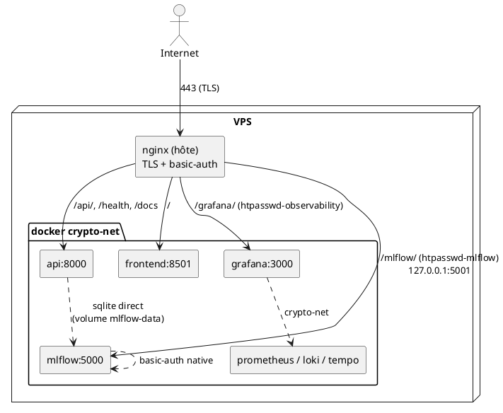

# Infra — CryptoBot

Infrastructure de production : Docker Compose (services applicatifs + observabilité),
provisionnée et déployée via Ansible (`infra/ansible/`), exposée par un nginx hôte
en reverse proxy TLS sur `https://dtsc-cryptobot.fr`.

## Topologie réseau



Prometheus / Loki / Tempo / MLflow ne sont **jamais** publiés sur l'internet :
ils ne sont joignables que via le réseau Docker `crypto-net` ou en `127.0.0.1`,
derrière nginx.

## Sécurité des endpoints d'observabilité

Grafana et MLflow suivent le **même modèle à deux couches** :

1. **Périmètre (nginx)** : `auth_basic` + fichier htpasswd dédié, généré par Ansible
   à partir de variables (jamais en clair dans le repo).
2. **Application** : login natif (Grafana `GF_SECURITY_ADMIN_*` / MLflow
   `--app-name basic-auth`), credentials via variables d'environnement.

Les deux sont servis sous un **sous-chemin** (`/grafana`, `/mlflow`) pour rester
cohérents et permettre la cohabitation sur le même vhost.

| Endpoint | nginx | htpasswd | App auth | Sous-chemin |
|----------|-------|----------|----------|-------------|
| Grafana  | `/grafana/` | `.htpasswd-observability` | `GF_SECURITY_ADMIN_*` | `GF_SERVER_SERVE_FROM_SUB_PATH` |
| MLflow   | `/mlflow/`  | `.htpasswd-mlflow`        | `--app-name basic-auth` | `--static-prefix /mlflow` |

### MLflow — avant / après

| | Avant | Après |
|-|-------|-------|
| Publication port | `5001:5000` (exposé sur **toutes** les interfaces) | `127.0.0.1:5001:5000` (localhost only) |
| Route nginx | aucune | `/mlflow/` avec `auth_basic` + `.htpasswd-mlflow` |
| Auth applicative | aucune | `--app-name basic-auth` (basic_auth.ini généré au runtime) |
| Sous-chemin | non | `--static-prefix /mlflow` |
| Accès externe | **public, sans auth** | TLS + basic-auth obligatoire |
| Accès interne | docker `crypto-net` | inchangé (`api` écrit le sqlite via le volume `mlflow-data`) |

Détail de l'astuce « credentials partagés » : nginx valide le `Authorization`
basic-auth contre `.htpasswd-mlflow` **puis le transmet** au backend. En utilisant
les **mêmes** identifiants pour le htpasswd et pour l'auth native MLflow, un seul
prompt navigateur satisfait les deux couches.

## Tracking MLflow : CI vs prod (volontairement distinct)

- **CI** (`.github/workflows/collector.yml`) : `MLFLOW_TRACKING_URI` pointe sur
  **DagsHub** (`https://dagshub.com/Marivel75/_Crypto_Bot.mlflow`), un MLflow hébergé
  joignable depuis les runners GitHub.
- **Prod** : MLflow **self-hosted** (sqlite) derrière nginx, non joignable depuis
  le CI. Le service `api` écrit directement le fichier sqlite via le volume partagé.

Les deux cibles sont indépendantes par conception : pas d'unification car le runner
CI ne peut pas atteindre le MLflow VPS et la prod ne doit pas dépendre d'un tiers.

## Génération / rotation des credentials

### GitHub Actions secrets requis (repo `jules-prod/cryptobot-fin`)

| Secret | Usage |
|--------|-------|
| `GRAFANA_ADMIN_USER` / `GRAFANA_ADMIN_PASSWORD` | Grafana (htpasswd + login natif) |
| `MLFLOW_TRACKING_USERNAME` / `MLFLOW_TRACKING_PASSWORD` | MLflow (htpasswd + basic-auth ; **aussi** utilisé en CI pour DagsHub) |
| `SMTP_HOST` / `SMTP_USER` / `SMTP_PASSWORD` / `SMTP_FROM` | Alerting Grafana |
| `ALERT_EMAIL_TO` | Destinataire des alertes |
| `VPS_HOST` / `VPS_SSH_KEY` | Déploiement Ansible |

Vérifier la présence : `gh secret list -R jules-prod/cryptobot-fin`.

### Rotation MLflow

1. Mettre à jour les secrets GitHub :
   ```bash
   gh secret set MLFLOW_TRACKING_USERNAME -R jules-prod/cryptobot-fin
   gh secret set MLFLOW_TRACKING_PASSWORD -R jules-prod/cryptobot-fin
   ```
2. Re-déclencher le déploiement (push sur `prod` ou `workflow_dispatch` sur
   `Deploy to VPS`). Ansible :
   - réécrit `.env` sur le VPS (`MLFLOW_TRACKING_USERNAME/PASSWORD`),
   - régénère `/etc/nginx/.htpasswd-mlflow` (idempotent, `community.general.htpasswd`),
   - le conteneur `mlflow` régénère `basic_auth.ini` au démarrage et met à jour
     l'utilisateur admin.
3. Le fichier `.htpasswd-mlflow` n'est **jamais** committé : il vit sur le VPS,
   généré par Ansible.

### Génération manuelle (debug VPS)

```bash
htpasswd -B -c /etc/nginx/.htpasswd-mlflow <user>   # -B = bcrypt
```

## Vérification post-déploiement

```bash
# Externe : 401 sans creds, 200 avec
curl -s -o /dev/null -w "%{http_code}\n" https://dtsc-cryptobot.fr/mlflow/        # 401
curl -s -o /dev/null -w "%{http_code}\n" -u user:pass https://dtsc-cryptobot.fr/mlflow/  # 200

# Le port MLflow n'est PAS exposé publiquement
nmap -p 5001 dtsc-cryptobot.fr   # closed/filtered

# Sur le VPS : healthcheck non authentifié
curl -f http://127.0.0.1:5001/mlflow/health
```
